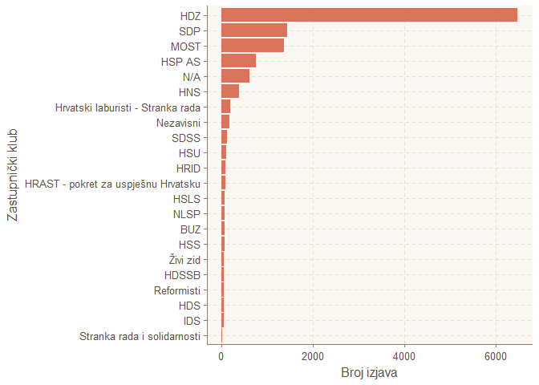

Saborski transkripti scraper
================

[RSelenium](https://github.com/ropensci/RSelenium) scraper za rasprave i zastupnička pitanja

Projekt sadržava funkcije potrebne za programski pristup podacima s edoc.sabor portala. Trenutno je moguće pristupati saborskim raspravama i zastupničkim pitanjima.

Saborske rasprave za 5.,6.,7.,8. i 9. saziv dostupne su u CSV formatu u folderu *CSV export*. Opis datoteka:

-   *rasprave\_saziv\_N.csv* = zaglavlja rasprava (kolona **ID** je identifikator rasprave)
-   *transkripti\_saziv\_N.csv* = transkripti rasprava (kolona **Rasprava\_ID** je veza na zaglavlje)

Projekt je nastao kao nadogradnja postojećeg scrapera u sklopu [Open Data Day 2018 hackathona](https://www.meetup.com/HrOpen/events/247705753/)

Izvor podataka: <http://edoc.sabor.hr/>

Datum pristupanja: 2018-03-04

Primjer učitavanja podataka
---------------------------

``` r
# load libs
library(tibble)
library(ggplot2)
library(dplyr)
library(ggthemr) # stiliziranje plotova, nije nuzno
library(magrittr)

# definiraj gdje su zipani podaci
url <- "https://github.com/rodik/Sabor/raw/master/CSV/saziv_8_csv.zip"

# download zip file containing transcript data, save it to the working directory
download.file(url = url, destfile="saziv_8.zip") 

# procitaj zaglavlja rasprava
rasprave_8 <- read.table(unz("saziv_8.zip", "rasprave_saziv_8.csv"), 
                   header=T, quote = "\"", sep=";", 
                   encoding = "UTF-8", stringsAsFactors = F)

# procitaj transkripte rasprava
transkripti_8 <- read.table(unz("saziv_8.zip", "transkripti_saziv_8.csv"), 
                   header=T, quote="\"", sep=";",
                   encoding = "UTF-8", stringsAsFactors = F)

# pretvori u tibble
rasprave_8 <- as_data_frame(rasprave_8)
transkripti_8 <- as_data_frame(transkripti_8)
```

Provjera učitanih tablica:

``` r
rasprave_8
```

    ## # A tibble: 172 x 7
    ##    Saziv Sjednica RedniBroj Naziv                URL      ImaSnimku     ID
    ##    <chr>    <int>     <int> <chr>                <chr>        <int>  <int>
    ##  1 VIII         3        67 "Prijedlog odluke o~ http://~         1 2.01e6
    ##  2 VIII         3        66 Prijedlog odluke o ~ http://~         1 2.01e6
    ##  3 VIII         3        65 Konaèni prijedlog z~ http://~         1 2.01e6
    ##  4 VIII         3        64 Prijedlog za pokret~ http://~         1 2.01e6
    ##  5 VIII         3        63 Konaèni prijedlog z~ http://~         1 2.01e6
    ##  6 VIII         3        62 Konaèni prijedlog z~ http://~         1 2.01e6
    ##  7 VIII         3        61 "Prijedlog odluke o~ http://~         1 2.01e6
    ##  8 VIII         3        60 Izvješæe o radu pra~ http://~         1 2.01e6
    ##  9 VIII         3        59 Izvješæe o radu pra~ http://~         1 2.01e6
    ## 10 VIII         3        58 Izvješæe o poslovan~ http://~         1 2.01e6
    ## # ... with 162 more rows

``` r
transkripti_8
```

    ## # A tibble: 12,196 x 5
    ##    Osoba  Transkript           RedniBrojIzjave Rasprava_ID ZastupnickiKlub
    ##    <chr>  <chr>                          <int>       <int> <chr>          
    ##  1 "Rein~ Sada bih vas zamoli~               1     2012625 HDZ            
    ##  2 "Iviæ~ Hvala lijepo gospod~               2     2012625 HDZ            
    ##  3 "Rein~ Hvala lijepa. Žele ~               3     2012625 HDZ            
    ##  4 "Stre~ Poštovani predsjedn~               4     2012625 MOST           
    ##  5 "Rein~ Hvala vam lijepa. S~               5     2012625 HDZ            
    ##  6 "Rein~ Sada bismo naravno ~               1     2012624 HDZ            
    ##  7 "Zgre~ Predsjednièe, toèka~               2     2012624 SDP            
    ##  8 "Rein~ Dobro, èini mi se d~               3     2012624 HDZ            
    ##  9 "Petr~ Poštovani predsjedn~               4     2012624 HRID           
    ## 10 "Rein~ Kolegice i kolege, ~               5     2012624 HDZ            
    ## # ... with 12,186 more rows

Primjer obrade i vizualizacije podataka
---------------------------------------

Osnovnim grupiranjem moguće je dobiti broj izjava prema npr. zastupničkom klubu:

``` r
# grupiraj podatke
grupirani_po_klubu <- transkripti_8 %>% 
    mutate( # ako ne postoji zastupnicki klub napisi N/A
        ZastupnickiKlub = if_else(ZastupnickiKlub=="",'N/A', ZastupnickiKlub)
    ) %>%
    group_by(ZastupnickiKlub) %>% # grupiraj po klubu
    summarise(BrojIzjava = n()) # izracunaj broj izjava prema klubu

# postavi temu za plotove
ggthemr('dust')    

# napravi barplot
grupirani_po_klubu %>%
    ggplot(aes(x = reorder(ZastupnickiKlub, BrojIzjava), y = BrojIzjava)) +
        geom_bar(stat = 'identity') +
        coord_flip() +
        xlab('Broj izjava') +
        ylab('Zastupnički klub')
```



Primjer pretrage prema riječima
-------------------------------

Filtriranjem kolone *Transkript* moguće je dohvatiti samo one izjave koje sadržavaju određeni pojam:

``` r
# dohvati sve izjave u kojima se spominje 'reforma' u bilo kojem obliku
filtrirani <- transkripti_8 %>% 
    filter( # filtriranje prema sadrzaju
        grepl("reform", Transkript)  
    ) %>% 
    group_by(Osoba) %>% # grupiraj prema Osobi
    summarise(BrojIzjava = n()) %>% # izracunaj broj izjava
    arrange(desc(BrojIzjava)) %>% # sortiraj prema broju izjava
    head(12) # uzmi samo prvih 12 s najvise izjava zbog cisceg plota
    
# napravi barplot
filtrirani %>%
    ggplot(aes(x = reorder(Osoba, BrojIzjava), y = BrojIzjava)) +
        geom_bar(stat = 'identity') +
        coord_flip() +
        xlab('Broj izjava') +
        ylab('Osoba') +
        ggtitle('Broj izjava u kojima se spominje riječ "reforma"')
```


